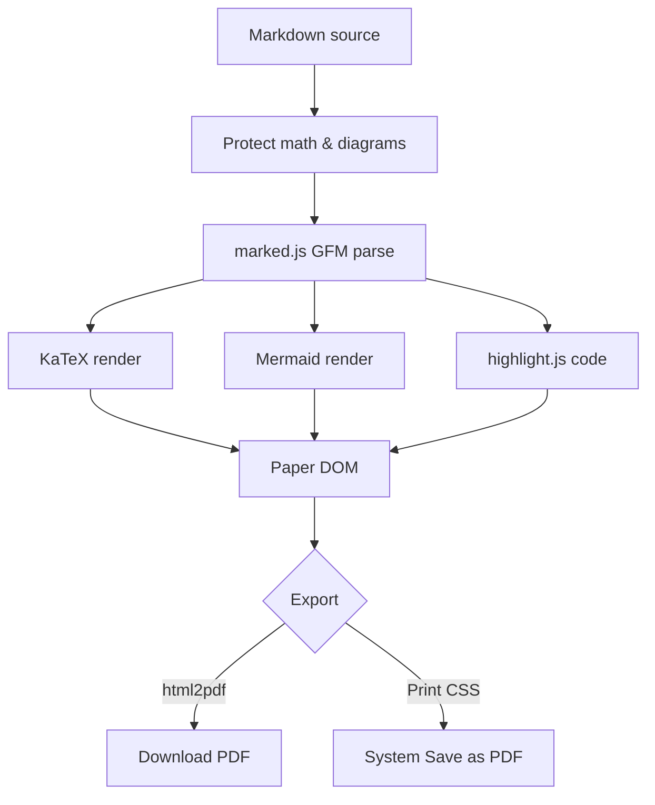
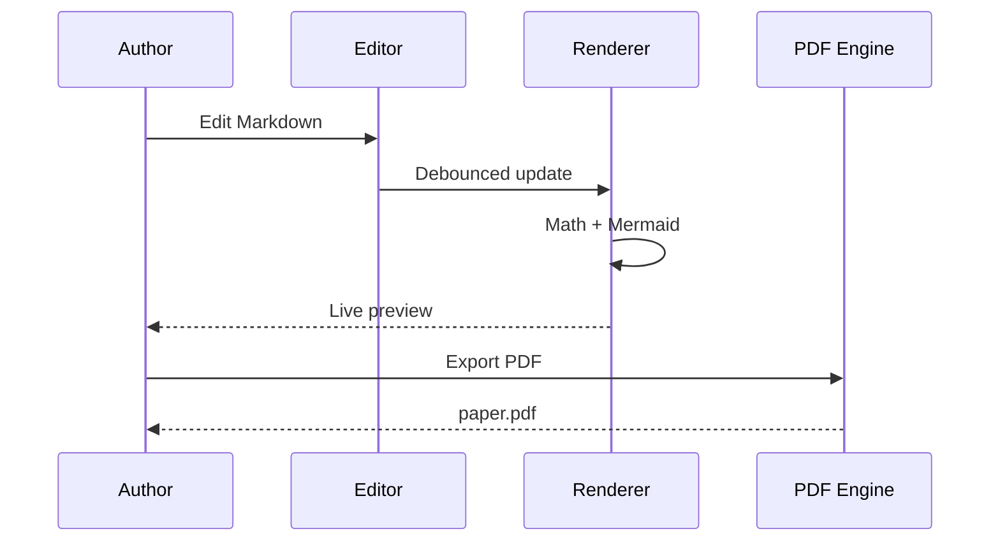

## Abstract

We present **PaperPDF**, a browser-native pipeline that converts Markdown into print-ready research PDFs with academic typography, KaTeX mathematics, and Mermaid diagrams—without a server. This sample document exercises headings, tables, figures, footnotes, multi-line equations, and flowcharts so you can validate layout, margins, and pagination before writing your own manuscript.

## 1. Introduction

Scientific writing demands predictable structure: running margins, stable type metrics, and figures that do not break across pages. Traditional toolchains (LaTeX, Word, Pandoc) remain excellent, yet a self-contained web tool is often enough for drafts, course reports, and internal notes.

This template demonstrates:

1. YAML front matter for title, authors, and keywords  
2. Inline math such as $E = mc^2$ and $\nabla \cdot \mathbf{B} = 0$  
3. Display equations and aligned systems  
4. GFM tables with captions  
5. Mermaid flowcharts and sequence diagrams  
6. Manual page breaks via `<!-- pagebreak -->`  
7. Footnotes for asides[^1]

Paragraphs after a section heading are unindented; subsequent paragraphs receive the preset first-line indent (for APA/MLA-style drafts) or spacing (for journal-style single spacing).

## 2. Method

### 2.1 Typesetting model

Let $\mathcal{D}$ be a Markdown document and $\mathcal{P}$ a paper preset. The renderer $R$ produces a paginated artifact:

$$
R(\mathcal{D}, \mathcal{P}) = \mathrm{PDF}
$$

Line height $\ell$, font size $s$, and margins $m = (m_t, m_r, m_b, m_l)$ fully determine the text block on a page of size $W \times H$:

$$
A_{\text{text}} = \bigl(W - m_l - m_r\bigr)\, \bigl(H - m_t - m_b\bigr).
$$

### 2.2 Mathematics

Maxwell’s equations in vacuum (SI units) may be written as an aligned block:

$$
\begin{aligned}
\nabla \cdot \mathbf{E} &= \frac{\rho}{\varepsilon_0} \\
\nabla \cdot \mathbf{B} &= 0 \\
\nabla \times \mathbf{E} &= -\frac{\partial \mathbf{B}}{\partial t} \\
\nabla \times \mathbf{B} &= \mu_0\mathbf{J} + \mu_0\varepsilon_0\frac{\partial \mathbf{E}}{\partial t}
\end{aligned}
$$

The normal distribution density is $\displaystyle f(x) = \frac{1}{\sigma\sqrt{2\pi}} \exp\!\Bigl(-\frac{(x-\mu)^2}{2\sigma^2}\Bigr)$.

### 2.3 Pipeline overview



### 2.4 Interaction sequence



## 3. Results

<!-- table: Comparison of export backends on a 12-page sample (illustrative). -->
| Backend | Text fidelity | Diagram quality | One-click download |
|---------|---------------|-----------------|--------------------|
| Browser print | Excellent | Excellent | No (dialog) |
| html2pdf.js | Very good | Very good | Yes |
| Server LaTeX | Best | Best | Depends |

Code listings remain monospaced and page-break averse:

```python
import numpy as np

def softmax(z):
    z = z - np.max(z, axis=-1, keepdims=True)
    e = np.exp(z)
    return e / e.sum(axis=-1, keepdims=True)
```

A compact complexity claim: training scales as $O(n^2 \cdot d)$ for sequence length $n$ and model width $d$, while inference with caching is closer to $O(n \cdot d)$ per step.

## 4. Discussion

Presets encode community norms rather than law. IEEE and ACM prefer compact two-column layouts; APA and MLA demand double spacing and one-inch margins; theses often require a larger binding margin on the left. PaperPDF exposes each of these as a first-class preset and allows continuous overrides for font, leading, and margins.

> “The best notation is no notation; whenever possible, write what you mean in words.”  
> — adapted from common mathematical style advice

When you need a hard break before a new major section or appendix, insert a page-break marker.

<!-- pagebreak -->

## 5. Conclusion

PaperPDF demonstrates that a careful composition of local libraries—Markdown parsing, KaTeX, Mermaid, print CSS, and html2pdf—yields a practical research drafting environment entirely offline. Replace this sample with your abstract, methods, and results; choose a preset that matches your venue; export when ready.

## References

1. Lovelace, A. & Turing, A. (2026). *Attention Is All You Simulate*. PaperPDF Sample Series.  
2. Knuth, D. E. (1984). *The TeXbook*. Addison-Wesley.  
3. Lamport, L. (1994). *LaTeX: A Document Preparation System* (2nd ed.). Addison-Wesley.

[^1]: Footnotes are written as `[^label]` in the text and defined as `[^label]: note body` anywhere in the source.
